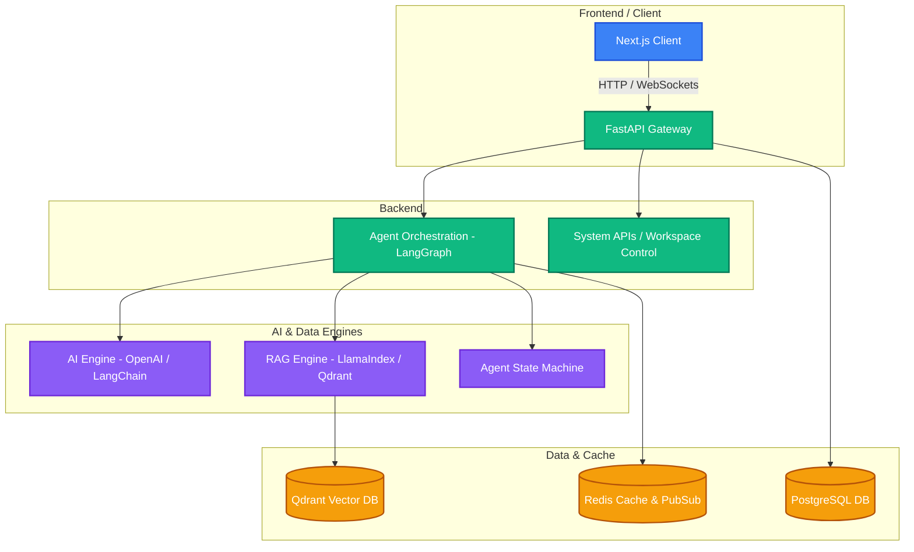

# 🚀 AI-Engineer-OS

[](https://opensource.org/licenses/MIT)
[](https://fastapi.tiangolo.com)
[](https://nextjs.org)
[](https://github.com/langchain-ai/langgraph)
[](https://qdrant.tech)

> An open-source, autonomous AI Software Engineer Operating System & Agent Developer platform designed to construct, test, debug, and deploy enterprise applications seamlessly.

---

## 🌌 Project Vision

**AI-Engineer-OS** is more than just a code generator—it is a cognitive operating system that behaves like an elite software engineering colleague. It integrates specialized agentic workflows with advanced Retrieval-Augmented Generation (RAG) and high-performance developer tools to achieve human-grade software development.

### Core Objectives
*   **Fully Autonomous Workflows**: Execute complex multi-file codebase operations, refactoring, and tool integrations with closed-loop validation.
*   **Context-Aware Coding**: Leverage multi-vector code embedding search and semantic graph indices via an advanced RAG engine.
*   **Safe Code Sandbox**: Execute and test code inside isolated containerized environments.
*   **Extensible Agent Framework**: Orchestrate flexible agent topologies (hierarchical, sequential, parallel) utilizing LangGraph state machines.

---

## 🏗️ Architecture Design

AI-Engineer-OS is structured as a scalable, high-performance monorepo separating worries across clean domain layers:



---

## 🛠️ Technology Stack

| Layer | Component | Technologies | Description |
| :--- | :--- | :--- | :--- |
| **Frontend** | User Interface | Next.js, React, TypeScript, TailwindCSS, shadcn/ui | Premium, dark-mode terminal-inspired workspace UI. |
| **Backend** | API Gateway & Service | FastAPI, Python, Pydantic, Uvicorn | High-performance, asynchronous REST & WebSocket routing. |
| **AI Stack** | Cognitive Core | OpenAI API, LangChain, LangGraph, LlamaIndex | State-driven workflow agents and structured code understanding. |
| **Vector DB**| RAG Indexing | Qdrant | High-speed semantic vector space search for codebase retrieval. |
| **Relational DB**| Persistance | PostgreSQL | Stores workspaces, user telemetry, system tasks, and session logs. |
| **Cache & Queue**| Message Broker | Redis | Real-time agent event streaming, celery-style queues, and caching. |
| **Infrastructure**| Development & Ops | Docker, Docker-Compose, Vercel, Railway | Immutable local dependency setup and unified cloud deployment. |

---

## 📂 Monorepo Folder Structure

```directory
AI-Engineer-OS/
├── frontend/          # Next.js Client App (TypeScript, Tailwind, shadcn)
├── backend/           # FastAPI Core Application Service (Python)
├── ai-engine/         # Cognitive algorithms, prompting systems, LLM wrappers
├── rag-system/        # Vector indexers, ingestion, codebase parsing (Qdrant/LlamaIndex)
├── agents/            # LangGraph multi-agent cognitive topologies & state models
├── docs/              # System architecture, schemas, guides, and plans
├── workflows/         # Pipeline orchestration, GitHub Actions, automations
├── deployment/        # Dockerfiles, docker-compose, and environment specifications
└── notebooks/         # Research, prototyping, and semantic-search experimentation
```

---

## 📅 Roadmap: Phase 1 — Foundation & Full Stack Basics (Days 1–30)

### 🗺️ Week 1: Environment, Git Setup, & Architecture Planning (Days 1–7)
*   **Day 1 (Current)**: Project setup, monorepo bootstrapping, directory mapping, `.gitignore` creation, architecture design, and initial git commit.
*   **Day 2–3**: Python/FastAPI environment configurations, base API design, dependency structures.
*   **Day 4–5**: Docker-compose setup for Qdrant, PostgreSQL, and Redis.
*   **Day 6–7**: Next.js app initialization, Tailwind styling design, and workspace branding.

### 🗺️ Week 2: Database Schemas, RAG & Vector Engine Setup (Days 8–15)
*   Establish Postgres schemas for sessions, tasks, and file changes.
*   Implement standard Qdrant clients with index structures.
*   Integrate LangChain and LlamaIndex code parsers to ingest code blocks locally.

### 🗺️ Week 3: API Orchestration & LangGraph Foundations (Days 16–22)
*   Build first agent state machines using LangGraph.
*   Construct event channels using WebSockets to stream agent logs back to UI.
*   Provide unified execution tool sandboxes.

### 🗺️ Week 4: UI Development & System Integration (Days 23–30)
*   Create a beautiful dashboard UI mimicking a terminal/IDE space.
*   Hook up API controls and workspace file exploration.
*   Validate end-to-end autonomous coding workflow tasks.

---

## 🚀 Getting Started

### 📋 Prerequisites
Ensure you have the following installed on your local developer machine:
*   [Docker Desktop](https://www.docker.com/products/docker-desktop/)
*   [Node.js (v18+)](https://nodejs.org/)
*   [Python (v3.10+)](https://www.python.org/downloads/)
*   [Git](https://git-scm.com/)

### 🛠️ Step 1: Clone the Repository
```bash
git clone https://github.com/Anirudh-saiA/AI-Engineer-OS.git
cd AI-Engineer-OS
```

### 🛠️ Step 2: Spin Up External Services
Use Docker Compose to run PostgreSQL, Qdrant, and Redis instantly:
```bash
docker-compose -f deployment/docker-compose.yml up -d
```

### 🛠️ Step 3: Run Backend APIs
Navigate to the `backend/` directory, set up virtual environment, install requirements, and run:
```bash
cd backend
python -m venv .venv
source .venv/bin/activate  # Or `.venv\Scripts\activate` on Windows
pip install -r requirements.txt
uvicorn main:app --reload
```

### 🛠️ Step 4: Run Frontend Workspace
In a new terminal shell:
```bash
cd frontend
npm install
npm run dev
```

---

## 📄 License
This project is licensed under the **MIT License**. Check out [LICENSE](LICENSE) for full details.
