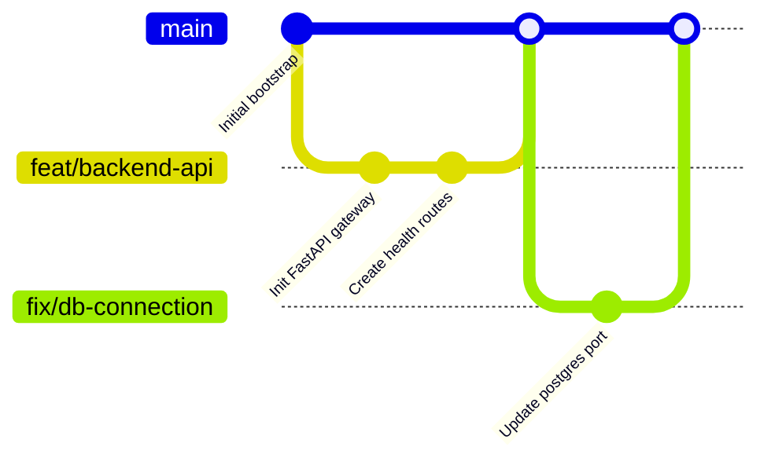

# Git Branching & Collaboration Guidelines

Welcome to the AI-Engineer-OS developer guidelines. To maintain an elite, professional, and clean codebase, all developers (and AI agents) must follow the branching and commit standards detailed below.

---

## 🌌 1. Git Branching Strategy (Git Flow Model)

We use a lightweight feature-branch workflow. Direct commits to `main` are restricted—all changes should go through reviews and PRs.



### Main Branches
*   **`main`**: Production-ready code. Every commit on `main` must compile successfully, pass all automated checks, and be fully tested.

### Ephemeral Branches
*   **Feature Branches (`feat/`)**: Used for developing new features. Spun off from `main` and merged back via Pull Request.
*   **Bugfix Branches (`fix/`)**: Used for fixing bugs.
*   **Documentation Branches (`docs/`)**: Used for updates to guides, markdown plans, and documentation.
*   **Refactor Branches (`refactor/`)**: Used for structural code cleanup that does not alter feature behavior.
*   **Chore Branches (`chore/`)**: Updating build systems, third-party libraries, and dependencies.

---

## 🏷️ 2. Branch Naming Conventions

Always name your branches in lowercase using hyphens to separate words. Use the following prefixes:

| Branch Type | Prefix Pattern | Example |
| :--- | :--- | :--- |
| **New Features** | `feat/<scope>-<description>` | `feat/backend-postgres-conn` |
| **Bug Fixes** | `fix/<scope>-<description>` | `fix/frontend-cors-error` |
| **Documentation** | `docs/<description>` | `docs/git-branching-strategy` |
| **Chore / Setup** | `chore/<description>` | `chore/update-pip-dependencies` |
| **Refactoring** | `refactor/<description>` | `refactor/api-response-wrapper` |

---

## ✍️ 3. Semantic Commit Messages

We adhere to the **Conventional Commits** specification. Commit messages must be structured as follows:

```
<type>(<scope>): <description>

[Optional body explaining details/motivation]
```

### Types:
*   `feat`: A new feature or endpoint.
*   `fix`: A bug fix (e.g. database auth fix).
*   `docs`: Documentation changes only (e.g. README, guides).
*   `style`: Code style modifications (formatting, white-space, missing semi-colons).
*   `refactor`: Structural refactoring that does not fix a bug or add a feature.
*   `chore`: Tooling updates, docker configurations, or library dependency updates.

### Examples:
*   `feat(backend): initialize database session mapping`
*   `fix(postgres): change host port to 5434 to prevent conflict`
*   `docs(readme): update system telemetry instructions`

---

## 🔄 4. Pull Request & Merging Workflow

1.  **Sync Local Main**: Before beginning work, ensure your local copy is up to date:
    ```bash
    git checkout main
    git pull origin main
    ```
2.  **Create Ephemeral Branch**:
    ```bash
    git checkout -b feat/my-new-endpoint
    ```
3.  **Make Small Commits**: Commit logically and semantic-check your messages.
4.  **Resolve Conflicts**: If `main` changes while you are working, rebase your branch:
    ```bash
    git checkout feat/my-new-endpoint
    git fetch origin
    git rebase origin/main
    ```
5.  **Submit Pull Request**: Push your branch and open a PR on GitHub. Squash-and-merge is preferred to keep the `main` history linear and clean.
